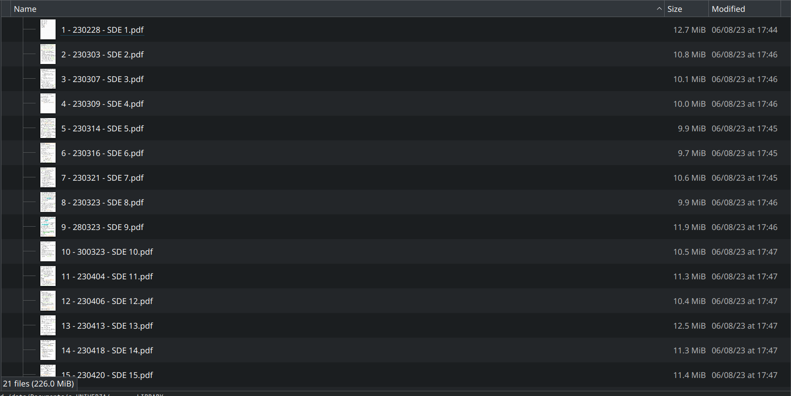

## Problem

I want to reorganise my whole university library more properly. To do that I sometimes need to unite numerous pdf files all together (e.g. my homeworks for GIP or my notes of SDEs). 

If there are many pdf files and I must do one single from all of them, I want to have a Table of Content (ToC) which shows me the position of the single individual file in the big pdf where the files are united together (extra: and possibly even an index in the beginning). If I do not have it, the file bundled together will become unuseful, because I will not know how to find informations quickly.

## Strategic Plan

Online there are tools to manage pdfs, but they are not automatised. Thus I would need a script which takes all pdf files in a folder, unites them, and creates an index for the obtained file signing at which page does the n-th file start. The suggestion is simply to unite the file with `pdfunite` and index it with `pdf.tocgen`. 

PS: there is also the program `HandyOutliner` I discovered (https://handyoutlinerfo.sourceforge.net/). This is good to manage bookmarks and ToCs, but still you need to create the PDF on your own first, and also in my case the job is repetitive, and I would thus just do the same thing over and over by clicking and writing here and there. It is better to create the command line tool.

For the `extra` part I have an idea: gather the file names and pages, and then write a Markdown file with the index, and convert it to pdf with the usual `pandoc` or similar, and append it in the beginning of the document.

## tactical plan

Use Rust. There are good resources on how to build a cli in rust online. A good video is: https://www.youtube.com/watch?v=lZ2xWczv1lI